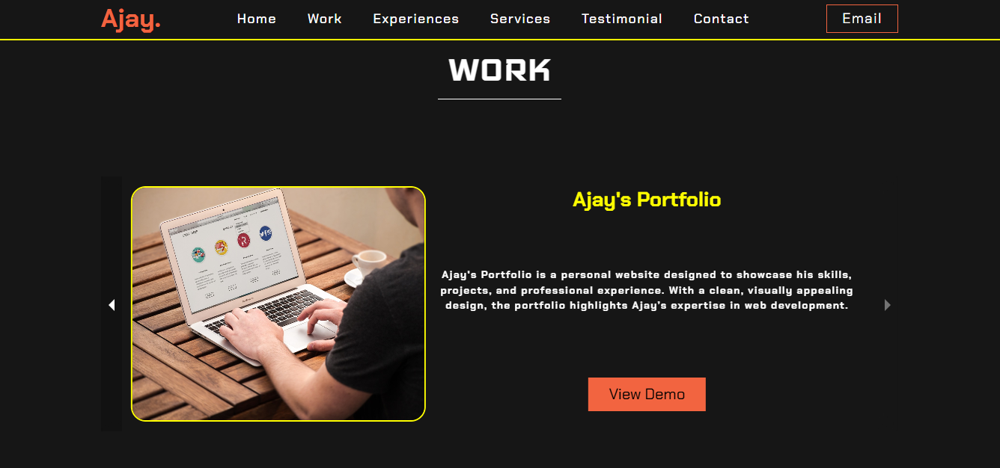

# Personal Portfolio Website - Ajay's Portfolio 🚀

Welcome to my personal portfolio website! This project showcases my skills, projects, and experience in web development. Built with React, Chakra UI, SCSS, and Firebase, this portfolio serves as a reflection of my web development journey.

## 📸 Screenshots

_The homepage featuring a hero section with a professional introduction._

_The projects section showcasing completed works with descriptions and links._

## 🚀 Features

- **Modern UI**: Responsive and accessible design built with [Chakra UI](https://chakra-ui.com/).
- **Styled with SCSS**: Custom and efficient styles created using [SCSS](https://sass-lang.com/).
- **Dynamic Data**: Firebase is used solely for handling "Contact Us" form submissions and storing user messages.
- **Interactive Components**: Built with React to ensure smooth, dynamic user experiences.

## 🔧 Tech Stack

- **Frontend**: 
  - [React](https://reactjs.org/)
  - [Chakra UI](https://chakra-ui.com/)
  - [SCSS](https://sass-lang.com/)
  
- **Backend**: 
  - [Firebase](https://firebase.google.com/) (only for handling form submissions)

## 🎯 Goals

- Provide a centralized platform for showcasing my work and skills.
- Create a user-friendly and visually appealing online presence.
- Serve as a resource for recruiters, collaborators, and clients.

## 🔧 How It Works

**Chakra UI**: The UI is styled using Chakra UI for consistency and responsiveness. Chakra UI’s component system helps in building reusable and accessible components.

**SCSS**: SCSS is used for custom styles. It allows for cleaner, more maintainable CSS, especially for complex layouts and reusable styles.

**React**: The project is built using React to manage the component-based structure, state management, and reactivity of the site.

**Firebase**: Firebase is used exclusively for handling submissions from the "Contact Us" form. Messages submitted through the form are stored in Firebase Firestore or Firebase Realtime Database for easy access and management.

## 🙏 Acknowledgments

- **[React](https://reactjs.org/)** - For being the core framework that makes this website dynamic and component-based.
- **[Chakra UI](https://chakra-ui.com/)** - For providing a beautiful and accessible UI component library that made styling the website faster and easier.
- **[SCSS](https://sass-lang.com/)** - For helping me manage styles efficiently with variables, mixins, and modularity.
- **[Firebase](https://firebase.google.com/)** - For offering a seamless, easy-to-integrate platform to handle user authentication and store data.
- **[GitHub](https://github.com/)** - For providing a platform to share and collaborate on code.
- **[web_host_most](https://webhostmost.com/)** - For offering a smooth and easy deployment process for frontend applications.
